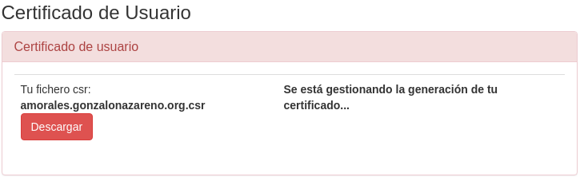
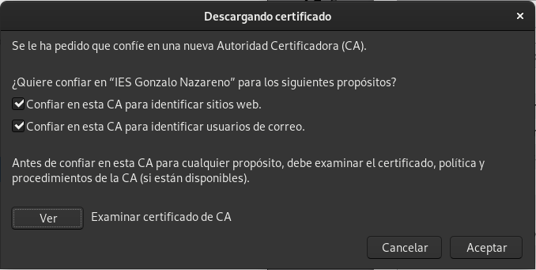

# Tarea 4) HTTPS

#### El siguiente paso de nuestro proyecto es configurar de forma adecuada el protocolo HTTPS en nuestro servidor nginx para nuestras dos aplicaciones web. Para ello vamos a emitir un certificado wildcard en la AC certbot Gonzalo Nazareno utilizando para la petición la utilidad "gestiona".

* Debes hacer una redirección para forzar el protocolo https

###### Los certificados SSL Wildcard protegen la dirección URL de tu sitio web, así como también un número ilimitado de sus subdominios.

##### Creacion del certificado

###### Para crear un certificado de Wildcard vamos a utilizar *openssl*

###### Instalamos el paquete *openssl*

~~~
sudo dnf install openssl
sudo dnf install mod_ssl
~~~

###### Creamos la clave privada con el siguiente comando

~~~
sudo openssl genrsa -out gonzalonazareno.pem 4096
   Generating RSA private key, 4096 bit long modulus (2 primes)
   ...............................................................................++++
   ............................................++++
   e is 65537 (0x010001)
~~~

###### Creamos un fichero de configuración, amorales.gonzalonazareno.org.conf, y le añadimos lo siguiente

~~~
[req]
default_bits = 4096
prompt = no
default_md = RSA
distinguished_name = dn

[ dn ]
C =             ES
ST =            Sevilla
L =             Dos Hermanas
O =             IES Gonzalo Nazareno
OU =            Informatica
emailAddress =  ale95mogra@gmail.com
CN =            *.amorales.gonzalonazareno.org
~~~

###### Creamos el certificado para nuestras páginas
sudo openssl req -new -sha256 -nodes -out amorales.gonzalonazareno.org.csr -newkey rsa:4096 -keyout gonzalonazareno.pem -config gonzalonazareno.conf
~~~

   Generating a RSA private key
   .......................................................................................   ............++++
   .......................................................................................   ........................................++++
   writing new private key to 'amorales.gonzalonazareno.org.key'
   -----
   You are about to be asked to enter information that will be incorporated
   into your certificate request.
   What you are about to enter is what is called a Distinguished Name or a DN.
   There are quite a few fields but you can leave some blank
   For some fields there will be a default value,
   If you enter '.', the field will be left blank.
   -----
   Country Name (2 letter code) [SP]:
   State or Province Name (full name) [Seville]:
   Locality Name (eg, city) [Dos Hermanas]:
   Organization Name (eg, company) [amorales]:
   Common Name (e.g. server FQDN or YOUR name) [*.amorales.gonzalonazareno.org]:
~~~

###### Comprobamos que se a generado bien

~~~
openssl req -in amorales.gonzalonazareno.org.csr -noout -text
Certificate Request:
    Data:
        Version: 1 (0x0)
        Subject: C = ES, ST = Sevilla, L = Dos Hermanas, O = IES Gonzalo Nazareno, OU = Informatica, emailAddress = ale95mogra@gmail.com, CN = *.amorales.gonzalonazareno.org
        Subject Public Key Info:
            Public Key Algorithm: rsaEncryption
                RSA Public-Key: (4096 bit)
                Modulus:
                    00:a8:d3:6a:48:38:b5:e4:86:04:78:04:4b:aa:e1:
                    3d:77:0f:12:12:b3:f6:b5:39:fa:62:26:1e:bf:58:
                    c4:b7:00:6c:37:87:04:d1:1b:a5:6c:e6:81:9b:3c:
                    53:eb:24:0d:ea:21:e9:3c:66:9e:16:f7:56:44:4f:
                    02:ee:7e:99:e7:69:5f:0b:53:4f:e8:5c:26:5b:bc:
                    68:a5:9a:b1:7e:c1:c9:0b:66:cf:9a:f4:4f:90:04:
                    0d:d4:29:19:17:09:1f:fd:9b:53:8e:53:93:78:22:
                    91:a9:0c:d1:12:fb:bf:36:63:d1:7c:90:ea:64:2b:
                    22:9a:a5:8a:c0:7e:3e:d6:ac:e0:70:b5:2c:03:9d:
                    83:54:45:1e:6a:90:48:ee:d1:d2:07:d7:e9:fe:3b:
                    52:64:5b:1f:19:70:c9:b8:2c:b9:4f:0c:28:09:ba:
                    2e:69:c7:af:60:e2:99:11:fb:d2:3a:90:77:e1:da:
                    b2:d9:4e:ba:b8:f9:64:aa:df:e0:7c:5a:e0:7f:d0:
                    80:e0:01:fc:3e:57:d3:14:81:72:57:6a:42:92:88:
                    47:5e:f3:5d:aa:54:9b:21:14:d2:9c:b3:b2:20:68:
                    40:51:8a:12:9f:33:da:1a:05:04:42:4a:51:0c:06:
                    3a:01:5c:43:96:32:0b:9a:32:74:26:f2:b9:88:d5:
                    99:55:42:ca:4a:e6:04:6e:67:bd:55:ff:3c:43:c0:
                    e2:4c:9c:bd:9b:8d:e5:a0:9c:04:3a:40:c7:00:be:
                    eb:d9:8b:bd:6f:11:5f:81:3d:29:ba:66:fe:4a:7e:
                    3c:fd:e9:34:4e:63:4f:7e:bb:2e:e9:6b:bd:21:82:
                    57:87:a3:52:ed:1d:2d:20:ef:77:32:1c:6a:79:34:
                    9f:6c:77:4c:26:1a:f2:c7:07:2f:8a:81:1e:3c:89:
                    6c:df:8f:e6:27:a0:43:6b:d3:95:6c:73:28:84:7d:
                    3b:5d:7e:99:10:e7:eb:6a:8a:4c:3c:25:30:31:11:
                    f9:04:04:d5:98:e3:53:78:86:3e:5b:0e:4e:cd:37:
                    61:e2:9f:8f:db:54:16:52:81:30:e0:3c:b5:e7:bd:
                    66:36:68:ae:0e:5e:c6:c6:5d:a0:34:a0:66:48:e3:
                    4c:40:16:13:57:cd:55:29:cf:01:e6:7b:95:03:f3:
                    fd:70:b3:3c:fc:62:b4:d0:8f:5e:a0:f5:1d:a3:45:
                    87:dd:27:62:64:c3:eb:e6:ea:35:c4:50:a1:f9:58:
                    d0:42:8b:5e:6d:01:97:93:b6:07:e8:ee:cd:e9:34:
                    34:00:9b:d3:91:e5:40:12:39:ab:3b:52:0c:96:f5:
                    8b:04:08:a0:0d:9a:d8:e7:e7:9c:61:6f:e2:3b:e2:
                    ea:ab:db
                Exponent: 65537 (0x10001)
        Attributes:
            a0:00
    Signature Algorithm: sha256WithRSAEncryption
         4c:10:c7:9b:a7:05:d5:bb:61:89:6e:11:86:f0:db:6b:41:27:
         d8:e0:8d:81:54:28:8e:98:4a:97:0f:1b:3b:92:3b:2c:1f:21:
         bd:46:a0:f3:ff:09:0f:34:37:eb:f4:47:36:0e:0b:37:60:fd:
         7a:a3:30:56:74:85:79:1a:a7:7a:9a:d9:56:c5:5e:5a:c6:f1:
         4a:42:b8:33:49:22:3a:93:81:6b:14:a2:fc:3b:6a:fc:83:5a:
         3a:96:7a:69:8d:ac:83:18:ec:9a:f9:f4:bc:27:94:18:59:82:
         93:e1:79:fb:d2:25:fa:9c:b1:f3:31:52:5f:cc:e3:02:70:b3:
         0b:55:05:43:cd:76:5a:36:fe:57:70:3a:0c:bd:cb:7d:ed:bf:
         8d:e4:ce:42:b9:21:88:b1:f5:ef:70:bc:d5:bd:4e:01:df:00:
         1d:9d:81:eb:16:1f:ca:9d:52:4a:e6:e3:0e:a9:b2:23:0c:25:
         38:be:02:92:ec:65:43:6b:f0:79:bc:e4:d6:49:27:23:0c:9f:
         34:e2:67:92:da:80:cf:6c:4d:d5:03:2c:e7:cb:5a:aa:db:e5:
         24:07:3a:8b:2f:a3:36:67:f9:ec:66:2e:6b:e4:cc:19:89:49:
         31:8f:55:e1:b4:5b:f2:f1:2d:13:fe:9f:b4:ce:2e:d3:05:1d:
         24:a5:c3:ca:bd:e1:0b:12:06:b3:b2:b8:c9:04:0c:92:01:f1:
         5b:ac:21:be:1b:5e:9d:f0:ad:4b:84:25:91:c1:97:4b:83:4b:
         93:fd:5a:6e:54:7b:6e:50:53:b8:9c:4e:b2:b8:ef:44:c0:38:
         f8:09:cc:bb:ad:9b:47:47:90:27:db:eb:f3:97:c9:d1:a0:25:
         e3:06:2a:a6:f4:10:a3:b7:ee:c0:64:eb:e2:59:16:84:82:62:
         da:52:4b:db:71:6b:68:95:be:4a:ff:8b:f6:6c:45:cf:18:b2:
         a4:12:32:e7:3c:3d:f4:73:d1:b2:82:84:7c:15:b6:ca:7f:0f:
         77:1e:7b:f8:f6:5d:49:98:1c:4a:38:ed:15:fd:8b:f5:99:75:
         66:2e:e4:1f:4a:20:79:27:aa:ae:74:2e:81:63:ca:d1:68:9c:
         78:db:4a:e8:85:b4:b5:b4:03:d5:17:d5:d3:3b:27:66:03:e1:
         27:dc:9b:d9:f2:9d:86:d4:fa:32:7e:c3:20:5c:a1:a8:3f:9d:
         c7:ab:b8:83:be:59:05:7e:39:87:40:e5:d4:65:33:5b:c0:9e:
         57:38:a2:a5:e5:78:d0:7c:76:f7:06:49:3f:d9:8b:74:82:ba:
         27:b6:48:04:ee:d7:e1:0e:65:41:82:fc:11:fc:f1:87:4c:46:
         3b:c8:80:18:57:d2:02:ef
~~~

###### Ahora tenemos que enviar el certificado a la autoridad certificadora de Gonzalonazareno para que nos la firme

###### Cuando tengamos disponible el certificado firmado, tenemos que añadir a los ficheros de configuración del hosting de wordpress y nextcloud las siguientes lineas a continuación del *listen 80*

~~~
listen 443;
ssl_certificate /etc/pki/tls/amorales.gonzalonazareno.org.crt;
ssl_certificate_key /etc/pki/tls/private/gonzalonazareno.pem;
~~~

###### Quedaría una cosa así

~~~
server {
    listen 80;
    listen 443 ssl;
    server_name cloud.amorales.gonzalonazareno.org;
    ssl_certificate /etc/pki/tls/amorales.gonzalonazareno.org.crt;
    ssl_certificate_key /etc/pki/tls/private/gonzalonazareno.pem;
~~~

###### Además tenemos que descomentar la parte de del ssl del fichero */etc/nginx/nginx.conf* y cambiar la ruta de nuestro certificado y de nuestra clave privada

~~~
server {
listen       443 ssl http2 default_server;
    listen       [::]:443 ssl http2 default_server;
    server_name  _;
    root         /usr/share/nginx/html;
    ssl_certificate "/etc/pki/tls/amorales.gonzalonazareno.org.crt";
    ssl_certificate_key "/etc/pki/tls/private/gonzalonazareno.pem";
    ssl_session_cache shared:SSL:1m;
    ssl_session_timeout  10m;
    ssl_ciphers PROFILE=SYSTEM;
    ssl_prefer_server_ciphers on;
    # Load configuration files for the default server block.
    include /etc/nginx/default.d/*.conf;
    location / {
    }
error_page 404 /404.html;
        location = /40x.html {
    }
error_page 500 502 503 504 /50x.html;
        location = /50x.html {
    }
}
~~~

###### Ahora tenemos que permitir a nginx que pueda leer en el directorio donde tenemos el certificado y la clave, ya que SElinux lo tiene bloqueado

~~~
restorecon -v -R /etc/pki/tls/
~~~

###### Reiniciamos el servicio de nginx

~~~
sudo systemctl restart nginx
~~~

###### Hecho esto podemos haceder a la dirección *https://* de los deos servicios, pero nos saldrá el mensaje de conexión privada

###### Para solucionar esto tenemos que añadir el certificado de la undidad certificadora del Gonzalonazareno en el navegador

###### Ahora ya tendremos certificadas las paginas de nextcloud y wordpress

