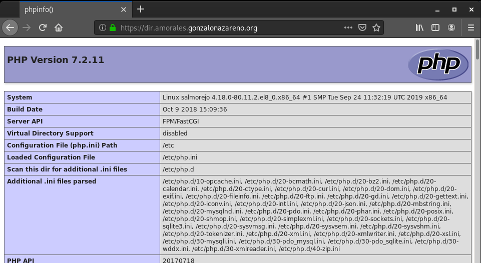
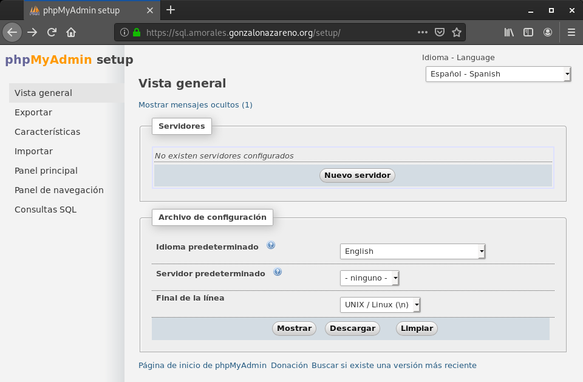
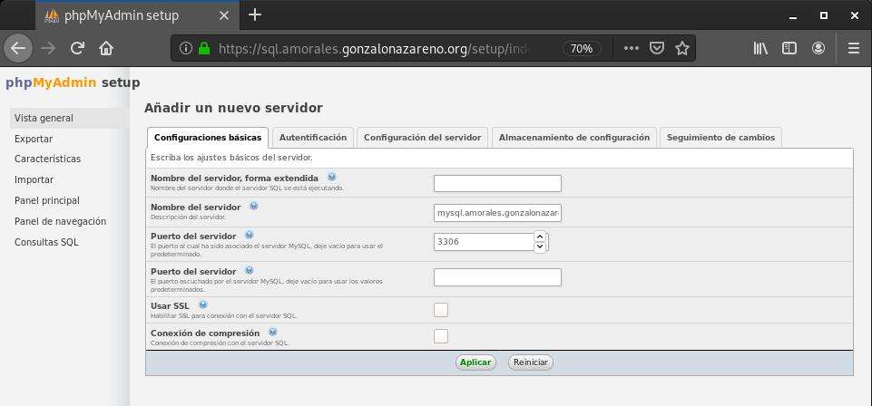
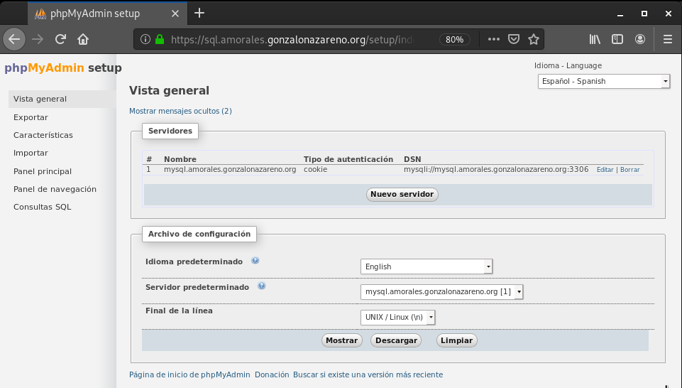
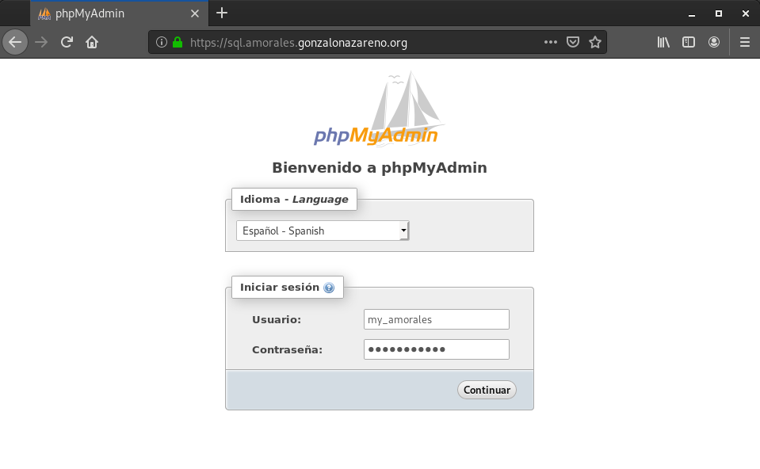
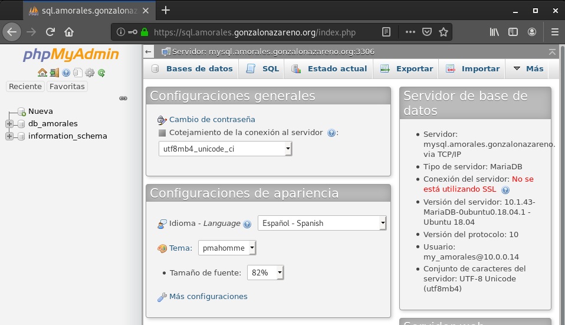
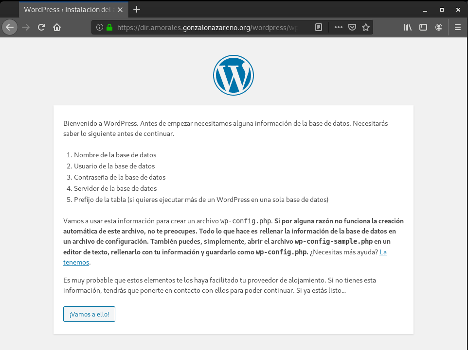
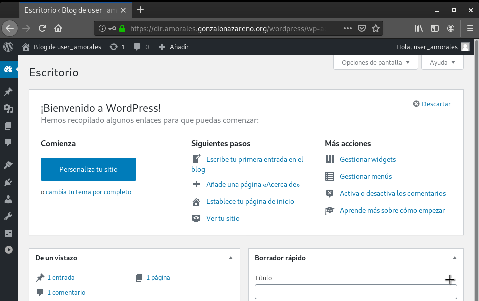
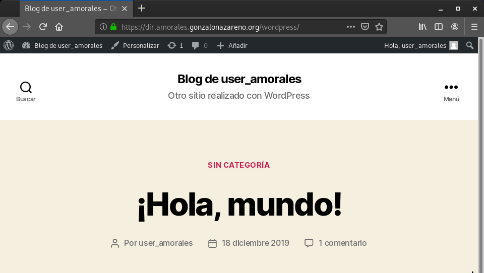

# Hosting, FTP y Automatización

#### Queremos que diferentes usuarios, puedan gestionar una página web en vuestro servidor que esté gestionada por medio de un FTP. También se creará una base de datos para cada usuario.

###### Antes de empezar tendremos que instalar y configurar el servidor de FTP en la máquina salmorejo con Centos 8

###### Tenemos que tenerel repositorio de EPEL 7 para poder instalar todas las dependencias correctamente. Aquí dejo como instalarlo en el caso de no tenerlo:

~~~
sudp wget https://dl.fedoraproject.org/pub/epel/epel-release-latest-7.noarch.rpm
ls * .rpm
sudo dnf install epel-release-latest-7.noarch.rpm -y
~~~

###### Ahora vamos a descargar los paquetes necesarios para proftpd

~~~
wget http://mirror.centos.org/centos/7/os/x86_64/Packages/GeoIP-1.5.0-14.el7.x86_64.rpm
sudo dnf install GeoIP-1.5.0-14.el7.x86_64.rpm
~~~

###### Instalar el paquete 'tcp_wrappers-libs' que es necesario

~~~
wget http://mirror.centos.org/centos/7/os/x86_64/Packages/tcp_wrappers-7.6-77.el7.x86_64.rpm
sudo dnf install tcp_wrappers-7.6-77.el7.x86_64.rpm
~~~

###### Ahora ya podemos instalar proftpd:

~~~
sudo dnf install proftpd -y
~~~

###### Vamos a habilitar los puertos de FTP en el firewall

~~~
sudo firewall-cmd --add-service=ftp --permanent --zone=public
sudo firewall-cmd --reload
~~~

###### Tenemos que iniciar y activar en el arranque proftpd

~~~
sudo systemctl start proftpd
sudo systemctl enable proftpd
~~~

#### Por ejemplo, el usuario josedom quiere hacer una página cuyo nombre será servicios:

-----------------------------------------------------------------------
* La página que vamos a crear será accesible en https://servicios.tunombre.gonzalonazareno.org.
-----------------------------------------------------------------------

##### Creación del virtualhosts:

###### Vamos a crear una web con el nombre 'https://dir.amorales.gonzalonazareno.org'

###### Para esto tenemos que crear un virtualhosting 'dir-amorales.conf' nuevo y añadimos las siguientes lineas:

~~~
server {
    listen 80;
    server_name  dir.amorales.gonzalonazareno.org;
    rewrite ^ https://$server_name$request_uri permanent;
}

server {
    listen 443 ssl;
    server_name  dir.amorales.gonzalonazareno.org;
    ssl on;
    ssl_certificate /etc/pki/tls/certs/amorales.gonzalonazareno.org.crt;
    ssl_certificate_key /etc/pki/tls/private/gonzalonazareno.pem;

    # note that these lines are originally from the "location /" block
    root   /usr/share/nginx/html/user_amorales;
    index index.php index.html index.htm info.php;

    location / {
        try_files $uri $uri/ /index.php?$args;
    }

    location ~ \.php$ {
        try_files $uri =404;
        fastcgi_pass unix:/var/run/php-fpm/www.sock;
        fastcgi_index index.php;
        fastcgi_param SCRIPT_FILENAME $document_root$fastcgi_script_name;
        include fastcgi_params;
    }
}
~~~

###### Creamos ahora el directorio en la direción '/usr/share/nginx/html/amorales' y añadimos un fichero 'info.php' para comprobar que todo funciona correctamente

~~~
sudo mkdir /usr/share/nginx/html/user_amorales
sudo touch /usr/share/nginx/html/user_amorales/info.php
~~~

###### Cambiamos permisos y propietario del DocumentRoot.
~~~
sudo chown -R user_amorales:user_amorales /usr/share/nginx/html/user_amorales/
sudo find /usr/share/nginx/html/user_amorales -type f -exec chmod 0644 {} \;
sudo find /usr/share/nginx/html/user_amorales -type d -exec chmod 0755 {} \;
sudo chcon -t httpd_sys_content_t /usr/share/nginx/html/user_amorales -R
~~~

###### Reiniciamos los servicios de nginx y php-fpm

~~~
sudo systemctl restart nginx
sudo systemctl restart php-fpm
~~~

##### Comprobación:

-----------------------------------------------------------------------

* Se creará un usuario user_josedom, que tendrá una contraseña, para que accediendo a ftp.tunombre.gonzalonazareno.org, pueda gestionar los ficheros de su página web.
-----------------------------------------------------------------------
##### Creación del usuario:

###### Vamos a crear el usuario 'user_amorales', con la contraseña 'SUHGuh234' para que pueda gestionar los ficheros de su web

~~~
sudo useradd user_amorales
sudo passwd user_amorales
~~~

##### Configuraciṕon del servidor de FTP:

###### Ahora vamos a configurar proftpd en el fichero '/etc/proftpd.conf'

###### Modificamos la linea del 'DefaultRoot'

~~~
DefaultRoot                     /usr/share/nginx/html/%u
~~~

###### Reiniciamos el servicio de proftpd:

~~~
sudo systemctl restart proftpd
~~~

###### Añadimos un nuevo registro al DNS:

~~~
ftp             IN      CNAME   salmorejo
~~~

##### Comprobación de conexión:

###### Listamos desde nuestro equipo.
~~~
[centos@salmorejo ~]$ ls -l /usr/share/nginx/html/user_amorales/
    total 0
    -rw-r--r--. 1 user_amorales user_amorales 0 dic 16 08:34 Prueba1.txt
    -rw-r--r--. 1 user_amorales user_amorales 0 dic 16 08:34 Prueba2.txt
    -rw-r--r--. 1 user_amorales user_amorales 0 dic 16 08:34 Prueba3.txt
    -rw-r--r--. 1 user_amorales user_amorales 0 dic 16 08:34 Prueba.txt
~~~

###### Listamos accediendo desde FTP.
~~~
moralg@padano:~$ ftp ftp.amorales.gonzalonazareno.org
    Connected to salmorejo.amorales.gonzalonazareno.org.
    220 FTP Server ready.
    Name (ftp.amorales.gonzalonazareno.org:moralg): user_amorales
    331 Password required for user_amorales
    Password:
    230 User user_amorales logged in
    Remote system type is UNIX.
    Using binary mode to transfer files.
ftp> ls
    200 PORT command successful
    150 Opening ASCII mode data connection for file list
    -rw-r--r--   1 user_amorales user_amorales        0 Dec 16 08:34 Prueba.txt
    -rw-r--r--   1 user_amorales user_amorales        0 Dec 16 08:34 Prueba1.txt
    -rw-r--r--   1 user_amorales user_amorales        0 Dec 16 08:34 Prueba2.txt
    -rw-r--r--   1 user_amorales user_amorales        0 Dec 16 08:34 Prueba3.txt
    226 Transfer complete
~~~

-----------------------------------------------------------------------
* Se creará un usuario en la base de datos llamado myjosedom. Este usuario tendrá una contraseña distinta a la del usuario del servidor FTP.
-----------------------------------------------------------------------
###### Creamos al usuario por ssh desde centos:
~~~
ssh ubuntu@tortilla 'sudo mysql -e "CREATE USER \"my_amorales\"@\"%\" IDENTIFIED BY \"my_amorales\";"'
~~~

-----------------------------------------------------------------------
* Se creará una bases de datos para el usuario anteriormente creado. Para que los usuarios gestionen su base de datos se puede instalar la aplicación phpmyadmin a la que se accederá con la URL https://sql.tunombre.gonzalonmazareno.org.
-----------------------------------------------------------------------

###### Creamos la base de datos desde centos:
~~~
ssh ubuntu@tortilla 'sudo mysql -e "CREATE DATABASE db_amorales;"'
~~~

###### Le asignamos privilegios sobre la base de datos creada al usuario anterior:
~~~
ssh ubuntu@tortilla 'sudo mysql -e "GRANT ALL PRIVILEGES ON db_amorales.* TO \"my_amorales\"@\"%\""'
~~~

##### phpMyAdmin

###### Descargamos phpMyAdmin.

~~~
wget https://files.phpmyadmin.net/phpMyAdmin/4.9.2/phpMyAdmin-4.9.2-all-languages.zip
~~~

###### Descargamos el paquete 'unzip' y descomprimimos el fichero 'phpMyAdmin-4.9.2-all-languages.zip'.

~~~
sudo dnf install unzip
unzip phpMyAdmin-4.9.2-all-languages.zip
~~~

###### Movemos el directorio creado a '/usr/share/nginx/html/phpmyadmin'

~~~
sudo mv phpMyAdmin-4.9.2-all-languages /usr/share/nginx/html/phpmyadmin
~~~

###### Cambiamos los permisos y el propietario del directorio 'phpmyadmin' y damos permiso al SELinux.

~~~
sudo chown nginx:nginx -R /usr/share/nginx/html/phpmyadmin/
sudo find /usr/share/nginx/html/phpmyadmin/ -type f -exec chmod 0644 {} \;
sudo find /usr/share/nginx/html/phpmyadmin/ -type d -exec chmod 0755 {} \;
sudo chcon -t httpd_sys_content_t /usr/share/nginx/html/phpmyadmin -R
sudo chcon -t httpd_sys_content_t /usr/share/nginx/html/phpmyadmin/ -R
sudo setsebool -P httpd_can_network_connect_db 1
~~~

###### Creamos el virtualhosting '/etc/nginx/conf.d/phpMyAdmin.conf'

~~~
server {
    listen 80;
    server_name  sql.amorales.gonzalonazareno.org;
    rewrite ^ https://$server_name$request_uri permanent;
}

server {
    listen 443 ssl;
    server_name  sql.amorales.gonzalonazareno.org;
    ssl on;
    ssl_certificate /etc/pki/tls/certs/amorales.gonzalonazareno.org.crt;
    ssl_certificate_key /etc/pki/tls/private/gonzalonazareno.pem;

    root   /usr/share/nginx/html/phpmyadmin;
    index index.php index.html index.htm;

    location / {
        try_files $uri $uri/ /index.php?$args;
    }

    location ~ \.php$ {
        try_files $uri =404;
        fastcgi_pass unix:/var/run/php-fpm/www.sock;
        fastcgi_index index.php;
        fastcgi_param SCRIPT_FILENAME $document_root$fastcgi_script_name;
        include fastcgi_params;
    }
}
~~~

###### Reiniciamos los servicios de nginx y php-fpm

~~~
sudo systemctl restart nginx
sudo systemctl restart php-fpm
~~~

###### Añadimos un nuevo registro al DNS del servidor de croqueta:

~~~
sql             IN      CNAME   salmorejo
~~~

###### Accedemos a la aplicación de phpMyAdmin con la dirección 'sql.amorales.gonzalonazareno.org/setup' para ir a la configuración de esta.

###### Hacemos click en 'Nuevo Servidor'

###### Ahora indicamos los datos del servidor de la base de datos de tortilla y hacemos click en 'Aplicar'

###### Nos mostrará el servidor al que nos vamos a conectar, hacemos click en 'Mostrar'

###### Renombramos el fichero 'config.sample.inc.php' a 'config.inc.php'

~~~
sudo cp /usr/share/nginx/html/phpmyadmin/config.sample.inc.php /usr/share/nginx/html/phpmyadmin/config.inc.php
~~~

###### Y el script de configuración que nos muestra, lo copiamos dentro del fichero 'config.inc.php'.

~~~
<?php
/*
 * Generated configuration file
 * Generated by: phpMyAdmin 4.9.2 setup script
 * Date: Mon, 16 Dec 2019 15:09:48 +0000
 */

/* Servers configuration */
$i = 0;

/* Server: mysql.amorales.gonzalonazareno.org [1] */
$i++;
$cfg['Servers'][$i]['verbose'] = '';
$cfg['Servers'][$i]['host'] = 'mysql.amorales.gonzalonazareno.org';
$cfg['Servers'][$i]['port'] = 3306;
$cfg['Servers'][$i]['socket'] = '';
$cfg['Servers'][$i]['auth_type'] = 'cookie';
$cfg['Servers'][$i]['user'] = 'root';
$cfg['Servers'][$i]['password'] = '';

/* End of servers configuration */

$cfg['blowfish_secret'] = 'D\'6:RUFqZ6O{{"Mx6d0aNLU+Ue_@>\'C';
$cfg['DefaultLang'] = 'en';
$cfg['ServerDefault'] = 1;
$cfg['UploadDir'] = '';
$cfg['SaveDir'] = '';
?>
~~~

###### Una vez que guardemos el fichero, ya tendremos los datos de acceso necesarios para acceder con el usuario 'my_amorales' a phMyAdmin. Para esto accedemos a la dirección 'sql.amorales.gonzalonazareno.org'

###### Y ya tendríamos acceso a nuestra base de datos 'db_amorales' como se muestra a continuación.

#### Tarea: Después de instalar manualmente los distintos servicios para crear un nuevo usuario que gestione su propia página web y tenga una base de datos a su disposición. Instala un CMS.

~~~
moralg@padano:~/Descargas$ ftp ftp.amorales.gonzalonazareno.org
    Connected to salmorejo.amorales.gonzalonazareno.org.
    220 FTP Server ready.

Name (dir.amorales.gonzalonazareno.org:moralg): user_amorales
    331 Password required for user_amorales

Password:
    230 User user_amorales logged in
    Remote system type is UNIX.
    Using binary mode to transfer files.

ftp> !ls
    wordpress

ftp> mput *

mput index.php?
    200 PORT command successful
    150 Opening BINARY mode data connection for index.php
    226 Transfer complete
    420 bytes sent in 0.01 secs (42.9483 kB/s)

mput licencia.txt?
    200 PORT command successful
    150 Opening BINARY mode data connection for licencia.txt
    226 Transfer complete
    17935 bytes sent in 0.01 secs (2.4529 MB/s)

mput license.txt?
    200 PORT command successful
    150 Opening BINARY mode data connection for license.txt
    226 Transfer complete
    19935 bytes sent in 0.02 secs (1.0832 MB/s)
.
.
.
~~~

###### Para subir los directorios tendremos que descargarnos otro cliente de ftp, utilizaremos 'lftp'

~~~
sudo apt install lftp
~~~

###### Nos conectamos y subimos los directorios:

~~~
moralg@padano:~/Descargas/wordpress$ lftp -u user_amorales ftp.amorales.gonzalonazareno.org
Clave:
lftp user_amorales@dir.amorales.gonzalonazareno.org:/> mirror -R wp-admin
lftp user_amorales@dir.amorales.gonzalonazareno.org:/> mirror -R wp-content
lftp user_amorales@dir.amorales.gonzalonazareno.org:/> mirror -R wp-includes
~~~

###### Ahora nos dirigimos a la  dirección 'dir.amorales.gonzalonazareno.org/wordpress'

###### Ahora solo quedaría completar el instalador del Wordpress ([Documentación del instalador de Wordpress](https://github.com/MoralG/Servidores_CLOUD/blob/master/Instalacion_Aplicaciones_Web.md#instalaci%C3%B3n-de-wordpress)) pero con los datos necesarios para conectarse a la base de datos del usuario 'user_amorales'

* **Nombre de la base de datos**: db_amorales
* **Nombre del usuario de la base de datos**: my_amorales
* **Contraseña del usuario de la base de datos**: my_amorales
* **Servidor de la base de datos**: mysql.amorales.gonzalonazareno.org

##### Comprobación:

###### Zona de administración del user_amorales

###### Zona pública

#### Mejora 1: Realiza un script que automatice la creación/borrado de nuevos usuarios en el hosting.

###### Pulse [AQUÍ](https://github.com/MoralG/Servidores_CLOUD/blob/master/Script_CreacionBorradoUsuariosFTP.sh) para ver el script.