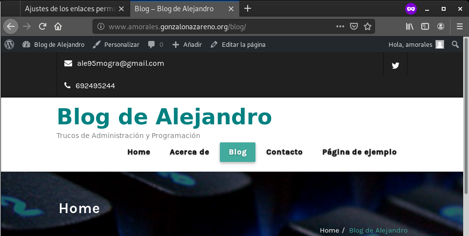

# Tarea 3. Instalación aplicaciones web (APLICACIONES WEB)

#### Vamos a instalar dos aplicaciones web php en nuestros servidores:

* En www.tunombre.gonzalonazareno.org vamos a instalar WordPress. En WordPress debemos configurar de forma correcta las URL limpias.
* En cloud.tunombre.gonzalonazareno.org vamos a instalar NextCloud.

#### Modifica las aplicaciones web y personalizalas para que se demuestre que son tus aplicaciones. Entrega una breve descripción de los pasos dados para conseguir la instalación de las aplicaciones web. Usando resolución estática entrega algunas capturas donde se demuestre que las aplicaciones están funcionando.

## Wordpress

##### Configuración:

###### Hay que descargar wordpress, descomprimirlo y moverlo al directorio html:
~~~
cd /tmp
sudo wget https://wordpress.org/latest.tar.gz
sudo tar xzvf latest.tar.gz
sudo mv wordpress /usr/share/nginx/html
~~~

###### Ahora vamos a modificar el fichero */etc/nginx/conf.d/default.conf*
~~~
server {
    listen	 80;
    server_name  www.amorales.gonzalonazareno.org;

    # note that these lines are originally from the "location /" block
    root   /usr/share/nginx/html/wordpress;
    index index.php index.html index.htm;

    location / {
        try_files $uri $uri/ =404;
    }
    error_page 404 /404.html;
    error_page 500 502 503 504 /50x.html;
    location = /50x.html {
        root /usr/share/nginx/html/wordpress;
    }

    location ~ \.php$ {
        try_files $uri =404;
        fastcgi_pass unix:/var/run/php-fpm/php-fpm.sock;
        fastcgi_index index.php;
        fastcgi_param SCRIPT_FILENAME $document_root$fastcgi_script_name;
        include fastcgi_params;
    }
}
~~~

###### Tenemos que asignarle el propietario *nginx* al directorio *wordpress*
~~~
sudo chown nginx:nginx -R /usr/share/nginx/html/wordpress
~~~

###### Y puede que tengamos que habilitar el *SELinux* , el cual, es el módulo de seguridad que admite políticas de seguridad de control de acceso, para habilitarla el http del puerto 80 del directorio *wordpress*:
~~~
sudo find /usr/share/nginx/html/wordpress -type f -exec chmod 0644 {} \;
sudo find /usr/share/nginx/html/wordpress -type d -exec chmod 0755 {} \;

sudo chcon -t httpd_sys_content_t /usr/share/nginx/html/wordpress -R
sudo chcon -t httpd_sys_rw_content_t /usr/share/nginx/html/wordpress/wp-config-sample.php
sudo chcon -t httpd_sys_rw_content_t /usr/share/nginx/htmlwordpress/wp-content -R
~~~

###### También tenemos que comprobar que podemos acceder a la base de datos de tortilla, para eso vamos a ver si tenemos en *on* la opción *httpd_can_network_connect_db*, esto lo podemos ver con el comando:
~~~
getsebool -a | grep httpd_can_network_connect_db
~~~
###### Si esta *off* tenemos que activarlo de la siguiente manera:
~~~
sudo setsebool -P httpd_can_network_connect_db 1
~~~

##### Instalación de Wordpress:

###### Ahora podemos acceder a la dirección www.amorales.gonzalonazareno.org y nos saltaría el instalador de wordpress:

###### Introducimos los datos de la base de datos de tortilla:

###### Ahora introducimos el nombre del sitio y usuario y contraseña:

###### Ya esta creado nuestro blog
###### Luego introducimos usuario y contraseña y accederemos a la zona de administración:

###### Modificamos el tema:

###### Ahora solo nos queda modificar las URL limpias, para esto, tenemos que ir al fichero *.conf* y modificar la linea *try_files* y poner esto:
~~~
try_files $uri $uri/ /index.php?$args;
~~~

###### Ahora ya podemos ir en el panel de administrador de wordpress a *Ajustes*->*Enlaces permanetes* y seleccionar por ejemplo la opción de *Nombre de la entrada*

##### Prueba de funcionamiento:

###### Con la opción por defecto:

###### Con la opción nombre de la entrada

## Nextcloud

##### Configuración:

###### En el servidor tortilla vamos a crear una nueva base de datos *nextcloud*
~~~
create database nextcloud;
~~~

###### Descargamos el cms y lo movemos al directorio */usr/share/nginx/html* 
~~~
cd /tmp
sudo wget https://download.nextcloud.com/server/releases/nextcloud-17.0.1.zip
sudo unzip nextcloud-17.0.1.zip
mv nextcloud /usr/share/nginx/html/
~~~

###### Cambiamos los permisos de dicha carpeta:
~~~
sudo chown nginx:nginx -R /usr/share/nginx/html/nextcloud
~~~

###### Copiamos el *.conf* de default para tener un fichero donde trabajar:
~~~
sudo cp /etc/nginx/conf.d/default.conf /etc/nginx/conf.d/nextcloud.conf 
~~~

###### Añadimos lo siguiente dentro de dicho fichero:
~~~
server {
    listen 80;
    server_name cloud.amorales.gonzalonazareno.org;

    # Add headers to serve security related headers
    add_header X-Content-Type-Options nosniff;
    add_header X-XSS-Protection "1; mode=block";
    add_header X-Robots-Tag none;
    add_header X-Download-Options noopen;
    add_header X-Permitted-Cross-Domain-Policies none;
    add_header Referrer-Policy no-referrer;

    #I found this header is needed on Debian/Ubuntu/CentOS/RHEL, but not on Arch Linux.
    add_header X-Frame-Options "SAMEORIGIN";

    # Path to the root of your installation
    root /usr/share/nginx/html/nextcloud/;

    access_log /var/log/nginx/nextcloud.access;
    error_log /var/log/nginx/nextcloud.error;

    location = /robots.txt {
        allow all;
        log_not_found off;
        access_log off;
    }

    # The following 2 rules are only needed for the user_webfinger app.
    # Uncomment it if you're planning to use this app.
    #rewrite ^/.well-known/host-meta /public.php?service=host-meta last;
    #rewrite ^/.well-known/host-meta.json /public.php?service=host-meta-json
    # last;

    location = /.well-known/carddav {
        return 301 $scheme://$host/remote.php/dav;
    }
    location = /.well-known/caldav {
       return 301 $scheme://$host/remote.php/dav;
    }

    location ~ /.well-known/acme-challenge {
      allow all;
    }

    # set max upload size
    client_max_body_size 512M;
    fastcgi_buffers 64 4K;

    # Disable gzip to avoid the removal of the ETag header
    gzip off;

    # Uncomment if your server is build with the ngx_pagespeed module
    # This module is currently not supported.
    #pagespeed off;

    error_page 403 /core/templates/403.php;
    error_page 404 /core/templates/404.php;

    location / {
       rewrite ^ /index.php$uri;
    }

    location ~ ^/(?:build|tests|config|lib|3rdparty|templates|data)/ {
       deny all;
    }
    location ~ ^/(?:\.|autotest|occ|issue|indie|db_|console) {
       deny all;
     }

    location ~ ^/(?:index|remote|public|cron|core/ajax/update|status|ocs/v[12]|updater/.+|ocs-provider/.+|core/templates/40[34])\.php(?:$|/) {
       include fastcgi_params;
       fastcgi_split_path_info ^(.+\.php)(/.*)$;
       fastcgi_param SCRIPT_FILENAME $document_root$fastcgi_script_name;
       fastcgi_param PATH_INFO $fastcgi_path_info;
       #Avoid sending the security headers twice
       fastcgi_param modHeadersAvailable true;
       fastcgi_param front_controller_active true;
       fastcgi_pass unix:/var/run/php-fpm/php-fpm.sock;
       fastcgi_intercept_errors on;
       fastcgi_request_buffering off;
    }

    location ~ ^/(?:updater|ocs-provider)(?:$|/) {
       try_files $uri/ =404;
       index index.php;
    }

    # Adding the cache control header for js and css files
    # Make sure it is BELOW the PHP block
    location ~* \.(?:css|js)$ {
        try_files $uri /index.php$uri$is_args$args;
        add_header Cache-Control "public, max-age=7200";
        # Add headers to serve security related headers (It is intended to
        # have those duplicated to the ones above)
        add_header X-Content-Type-Options nosniff;
        add_header X-XSS-Protection "1; mode=block";
        add_header X-Robots-Tag none;
        add_header X-Download-Options noopen;
        add_header X-Permitted-Cross-Domain-Policies none;
        # Optional: Don't log access to assets
        access_log off;
   }
   location ~* \.(?:svg|gif|png|html|ttf|woff|ico|jpg|jpeg)$ {
        try_files $uri /index.php$uri$is_args$args;
        # Optional: Don't log access to other assets
        access_log off;
   }
}

~~~

###### Ahora tenemos que crea el directorio *nextcloud-data*, el cual es necesario para guardar los archivos del usuario.
~~~
sudo mkdir /usr/share/nginx/html/nextcloud/nextcloud-data
sudo chown -R nginx:nginx /usr/share/nginx/html/nextcloud/nextcloud-data
sudo chcon -t httpd_sys_rw_content_t /usr/share/nginx/html/nextcloud/nextcloud-data -R
~~~

###### También hay que configurar el SELinux de Centos para que tengamos conexión al exterior.
~~~
sudo setsebool -P httpd_can_network_connect 1
~~~

###### Instalamos los siguientes módulos, ya que son dependencias de nextcloud:
~~~
sudo yum install php-common php-gd php-json php-curl php-zip php-xml php-mbstring php-bz2 php-intl
~~~

###### Ademas necesitamos que SELinux permita que PHP_FPM use execrem
~~~
sudo setsebool -P httpd_execmem 1
~~~

###### Necesitamos que SELinux pueda escribir y leer en el directorio de nextcloud:
~~~
sudo chcon -t httpd_sys_rw_content_t /usr/share/nginx/html/nextcloud/ -R
~~~

###### También tenemos que cambiar 3 directorios que lo utiliza apache pero al estar usando nginx hay que cambiarlos:
~~~
sudo setfacl -R -m u:nginx:rwx /var/lib/php/opcache/
sudo setfacl -R -m u:nginx:rwx /var/lib/php/session/
sudo setfacl -R -m u:nginx:rwx /var/lib/php/wsdlcache/
~~~

###### Ahora tenemos que reiniciar el sevicio de *nginx* y el del *php-fpm*
~~~
sudo systemctl restart nginx
sudo systemctl restart php-fpm
~~~

##### Instalación de NextCloud:

###### Ahora abrimos la dirección cloud.amorales.gonzalonazareno.org y saldra lo siguiente:

###### Si nos salta un error *504 Gateway Timeout error*. Esto significa que se ha superado el tiempo de espera, para solucionar esto tenemos que modificar algunas lineas de algunos ficheros:

###### Modificamos el fichero */etc/php.ini*
~~~
max_execution_time = 300
~~~

###### Modificamos el fichero */etc/php-fpm.d/www.conf*
~~~
request_terminate_timeout = 300
~~~

###### Añadimos la siguiente linea del fichero */etc/nginx/conf.d/nextcloud.conf*
~~~
fastcgi_read_timeout 300;
~~~

##### Prueba de funcionamiento:

###### Luego de todo, si lo hemos realizado todo bien, nos pedirá de nuevo los datos de administrador y accederemos al la pagina principal de Nextcloud

