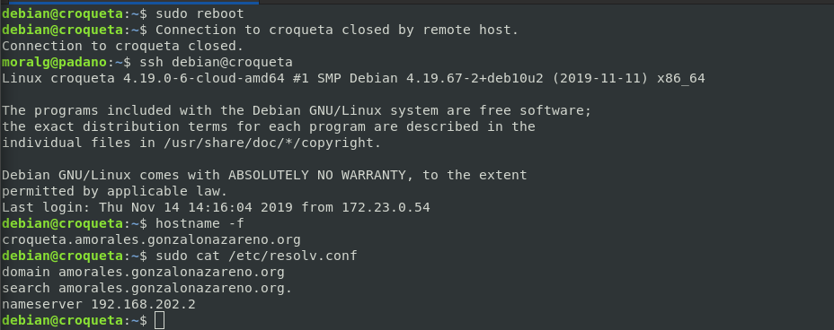
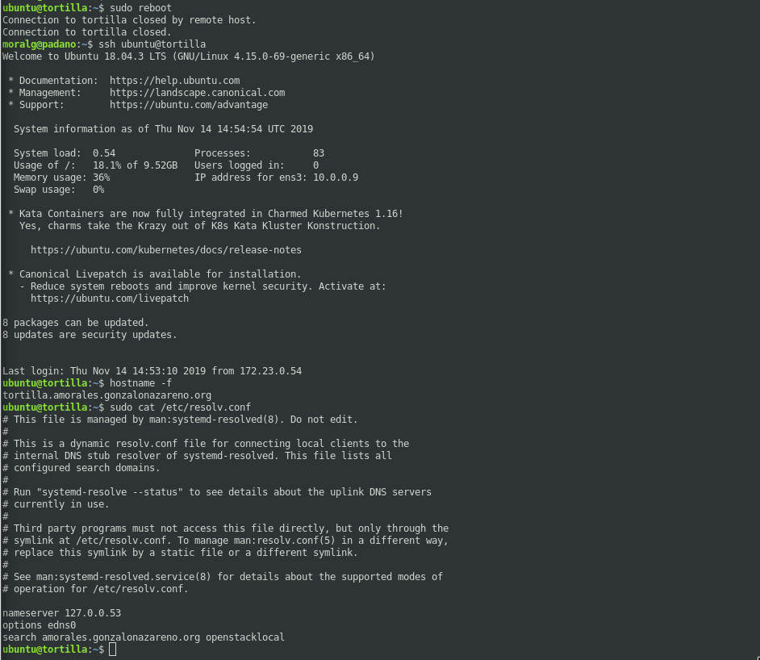
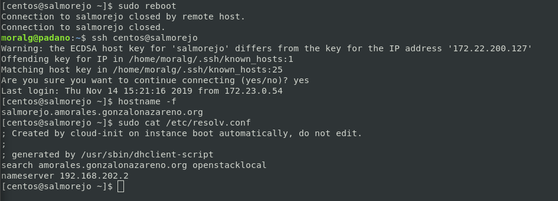
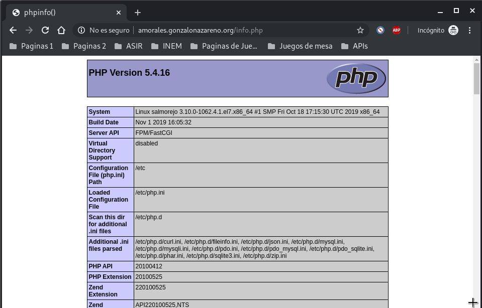
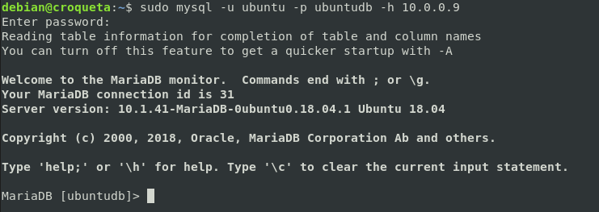
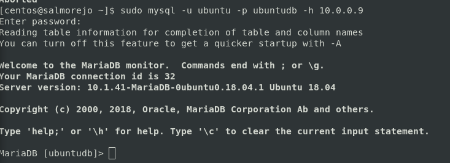

## Tarea 2. [Instalación de un servidor Web (SERVICIOS)]()
#### Ante de realizar la instalación del servidor web vamos a configurar el nombre de nuestras máquinas, para ello:

#### *Nombre de domino*
------------------------------------------------------------------------

1. Piensa en un nombre de dominio, que sera un subdominio de gonzalonazareno.org, y que contenga tu nombre, por ejemplo: josedom.gonzalonazareno.org.
2. Siguiendo con el ejemplo, los nombres de mis máquinas serán:

* croqueta.josedom.gonzalonazareno.org
* tortilla.josedom.gonzalonazareno.org
* salmorejo.josedom.gonzalonazareno.org

#### Comprueba que los servidores tienen configurados el nuevo nombre de dominio de forma adecuada después de volver a reiniciar el servidor (o tomar una nueva configuración DHCP). Para que el servidor tenga el FQDN debes tener configurado de forma correcta el parámetro domain en el fichero /etc/resolv.conf, además debemos evitar que este fichero se sobreescriba con los datos que manda el servidor DHCP de OpenStack. Quizás sea buena idea mirar la configuración de cloud-init. Documenta la configuración que has tenido que modificar y muestra el contenido del fichero /etc/resolv.conf y la salida del comando hostname -f después de un reinicio.

##### Croqueta

###### Añadimos al fichero */etc/hosts* la siguiente linea:

~~~
127.0.1.1       croqueta.amorales.gonzalonazareno.org croqueta
~~~

###### Añadimos al fichero *etc/hostname* la siguiente linea:

~~~
croqueta
~~~

###### Vamos a modificar el fichero */etc/dhcp/dhclient.conf*

~~~
supersede domain-name "amorales.gonzalonazareno.org";
supersede domain-search "amorales.gonzalonazareno.org";
~~~

###### Reiniciamos la máquina para ver que todo esta bien:

##### Tortilla

###### Añadimos al fichero */etc/hosts* la siguiente linea:

~~~
127.0.1.1       tortilla.amorales.gonzalonazareno.org tortilla
~~~

###### Añadimos al fichero *etc/hostname* la siguiente linea:

~~~
tortilla
~~~

###### modificar el fichero */etc/systemd/resolved.conf *

~~~
[Resolve]
DNS=192.168.202.2
Domains=amorales.gonzalonazareno.org
~~~

###### Reiniciamos la máquina para ver que todo esta bien:

##### Salmorejo

###### Añadimos al fichero */etc/hosts* la siguiente linea:

~~~
127.0.1.1       salmorejo.amorales.gonzalonazareno.org salmorejo
~~~

###### Añadimos el siguiente comando:

~~~
sudo hostnamectl set-hostname salmorejo --static
~~~

###### Añadimos en el fichero */etc/resolv.conf*

~~~
search amoral.gonzalonazareno.org openstacklocal
~~~

###### Ejecutamos el siguiente comando para que no cambie dicho fichero:

~~~
sudo chattr +i /etc/resolv.conf
~~~

###### Reiniciamos la máquina para ver que todo esta bien:

#### *Servidor Web*
------------------------------------------------------------------------

#### En salmorejo (CentOs 7) vamos a instalar un servidor web nginx. Configura el servidor para que sea capaz de ejecutar código php (para ello vamos a usar un servidor de aplicaciones php-fpm). Entrega una captura de pantalla accediendo a www.tunombre.gonzalonazareno.org/info.php donde se vea la salida del fichero info.php.

###### Añadimos el repositorio de *epel*

~~~
sudo yum install epel-release
~~~

###### Instalamos *Nginx*

~~~
sudo yum install nginx
~~~

###### Activamos el servicio de Nginx

~~~
sudo systemctl start nginx
~~~

###### Instalamos los módulos necesarios de php para Nginx y MariaDB

~~~
sudo yum install php php-mysql php-fpm
~~~

###### Tenemos que descomentar del fichero */etc/php.ini* la siguiente linea y ponerla a 0 para una mayor seguridad

~~~
cgi.fix_pathinfo=0
~~~

###### Ahora modificamos algunas lineas del fichero  */etc/php-fpm.d/www.conf* (descomentamos las que esten comentadas)

~~~
listen = /var/run/php-fpm/php-fpm.sock
listen.owner = nobody
listen.group = nobody
user = nginx
group = nginx
~~~

###### Iniciamos el proceso de php y lo habilitamos 

~~~
sudo systemctl start php-fpm
sudo systemctl enable php-fpm
~~~

###### Ahora tenemos que configurar Nginx para que reconozca php
###### Vamos a crear el fichero */etc/nginx/conf.d/default.conf* y metemos dentro:

~~~
server {
    listen	 80;
    server_name  www.amorales.gonzalonazareno.org;

    # note that these lines are originally from the "location /" block
    root   /usr/share/nginx/html;
    index index.php index.html index.htm;

    location / {
        try_files $uri $uri/ =404;
    }
    error_page 404 /404.html;
    error_page 500 502 503 504 /50x.html;
    location = /50x.html {
        root /usr/share/nginx/html;
    }

    location ~ \.php$ {
        try_files $uri =404;
        fastcgi_pass unix:/var/run/php-fpm/php-fpm.sock;
        fastcgi_index index.php;
        fastcgi_param SCRIPT_FILENAME $document_root$fastcgi_script_name;
        include fastcgi_params;
    }
}
~~~

###### Reiniciamos el servicio:

~~~
sudo systemctl restart nginx
~~~

###### Creamos en el directorio */usr/share/nginx/html/* el fichero *info.php* y le añadimos lo siguiente para ver la página de pruebas de php

~~~
<?php phpinfo(); ?>
~~~ 

###### Añadimos la linea necesario al fichero */etc/hosts* del cliente y probamos nuestra página con la dirección www.amorales.gonzalonazareno.org

#### *Servidor de base de datos*
------------------------------------------------------------------------

#### En tortilla (Ubuntu) vamos a instalar un servidor de base de datos mariadb. Entrega una prueba de funcionamiento donde se vea como se realiza una conexión a la base de datos desde los otros dos equipos.

##### Tortilla

###### Instalamos el paquete de Mariadb:

~~~
sudo apt install mariadb-server
~~~

###### Ahora vamos a configurar la contraseña del root y borraremos los usuarios y base de datos por defectos:

~~~
sudo mysql_secure_installation

  Enter current password for root (enter for none): 

  Set root password? [Y/n] y
    New password: root
    Re-enter new password: root

  Remove anonymous users? [Y/n] y

  Disallow root login remotely? [Y/n] y

  Remove test database and access to it? [Y/n] y

  Reload privilege tables now? [Y/n] y
~~~

###### Ahora vamos a modificar un linea del fichero */etc/mysql/mariadb.conf.d/50-server.cnf*

~~~
bind-address            = 0.0.0.0
~~~

###### Reiniciamos el servicio:

~~~
sudo systemctl restart mariadb.service
~~~

###### Nos conectamos a mariadb con root:

~~~
sudo mysql -u root
~~~

###### Creamos la base de datos y el usuario:

~~~
CREATE USER 'ubuntu'@'%' IDENTIFIED BY 'ubuntu';
create database wordpress;
~~~

###### Asignamos los permisos al usuario para que tenga acceso remoto desde cualquier host:

~~~
GRANT ALL PRIVILEGES ON *.* TO ubuntu@'%' IDENTIFIED BY 'ubuntu';
GRANT ALL PRIVILEGES ON *.* TO ubuntu@localhost IDENTIFIED BY 'ubuntu';
~~~

###### Ahora tenemos que descargarnos en croqueta y salmorejo el cliente de MariaDB:

##### Croqueta

~~~
sudo apt install mariadb-client
~~~

###### Para conectarse a la base de datos de Tortilla es:

~~~
sudo mysql -u ubuntu -p ubuntudb -h 10.0.0.9
~~~

##### Salmorejo

~~~
sudo yum groupinstall -y mariadb-client
~~~

###### Para conectarse a la base de datos de Tortilla es:

~~~
sudo mysql -u ubuntu -p ubuntudb -h 10.0.0.9
~~~

