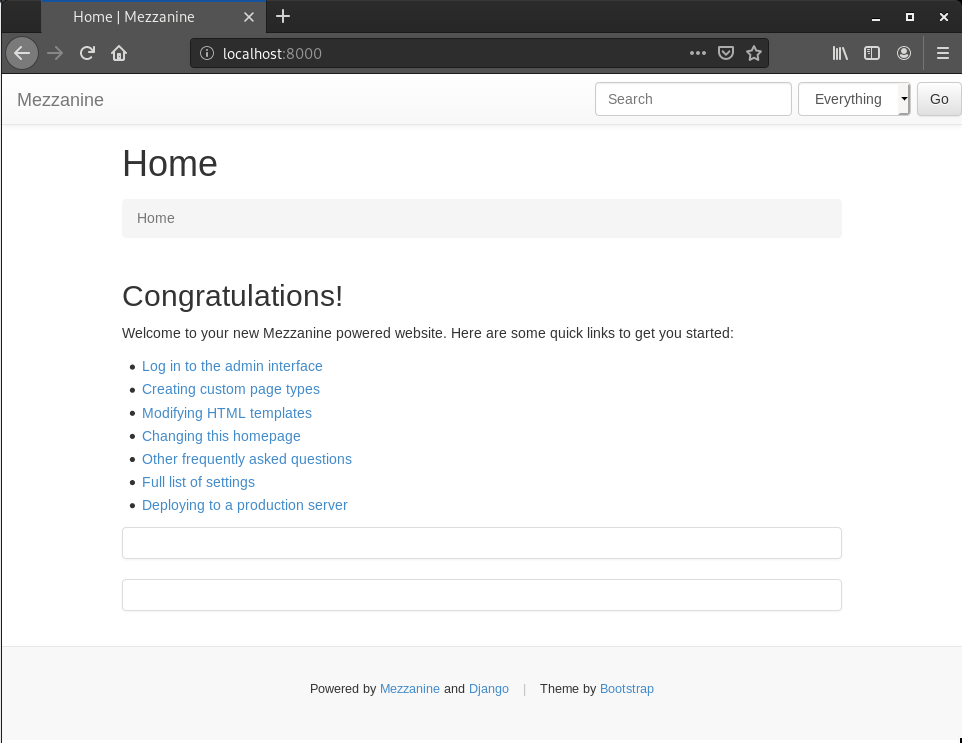
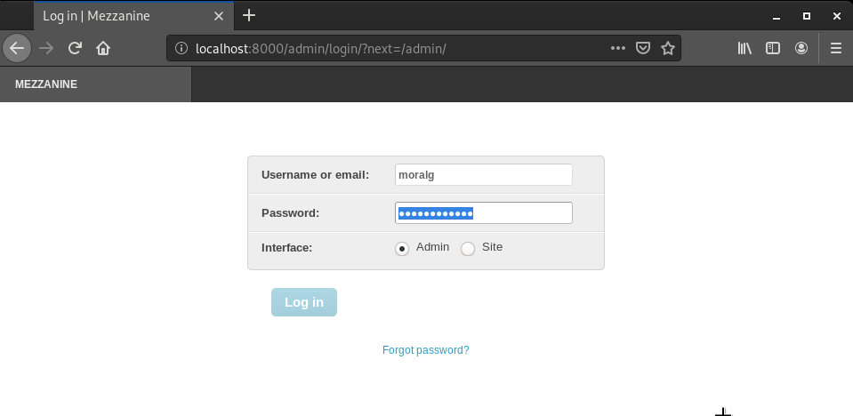
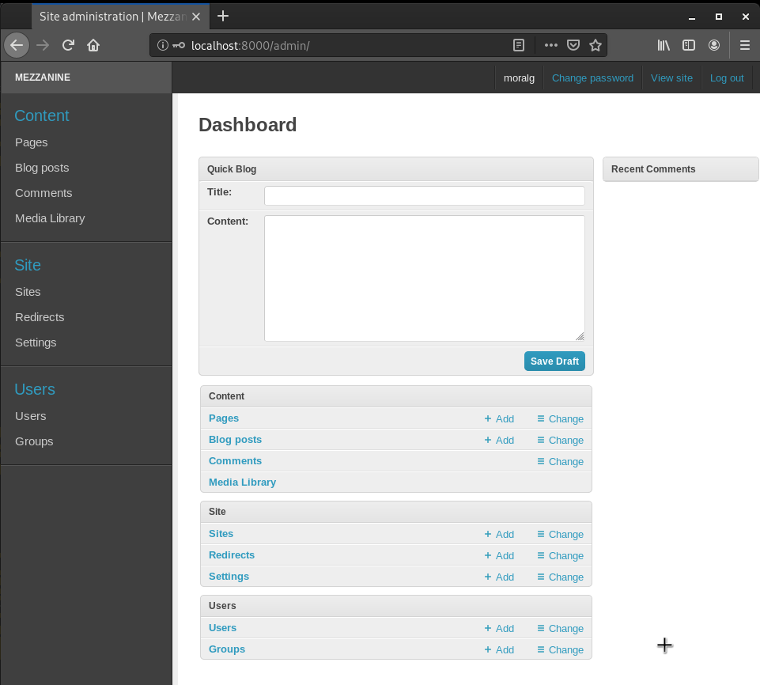
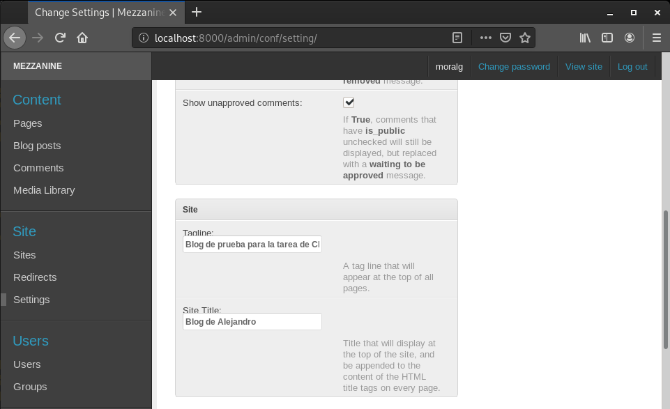
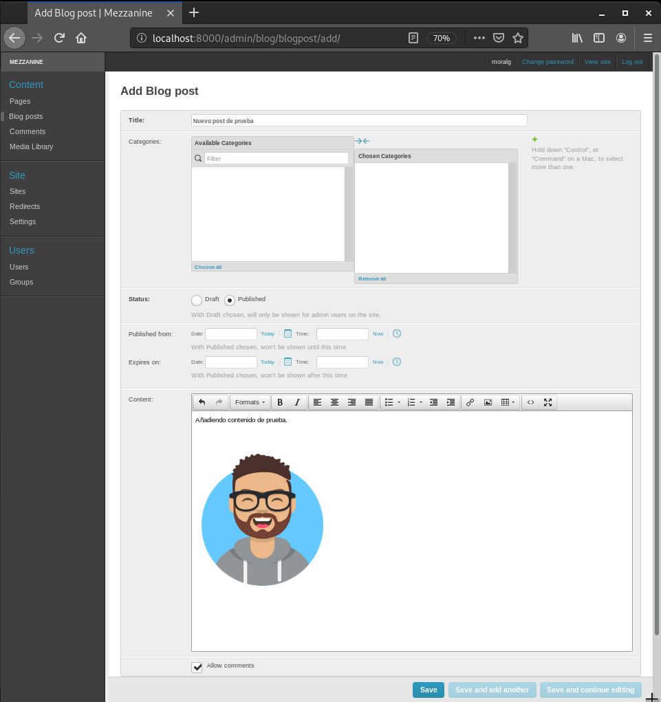
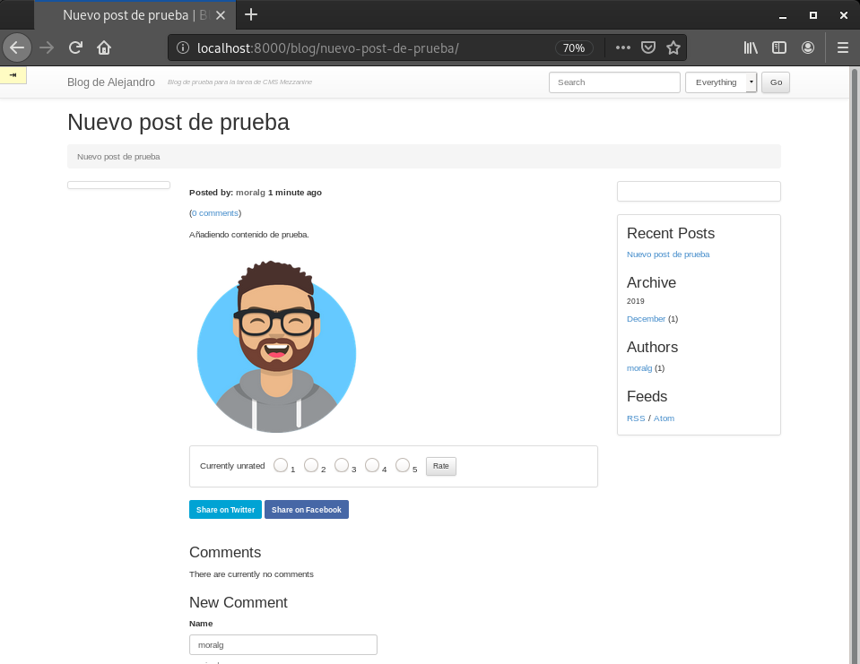

# Tarea 8) Instalación de aplicación python (APLICACIONES WEBS)

#### En esta tarea vamos a desplegar un CMS python . Hemos elegido Mezzanine, pero puedes elegir otro CMS python basado en django.

### 1. Instala el CMS en el entorno de desarrollo. Debes utilizar un entorno virtual.
-------------------------------------------------------------------

###### Creamos el entorno virtual de la siguiente manera:
~~~
python3 -m venv Mezzanine
source Mezzanine/bin/activate
~~~

###### Ahora intalamos mezzanine en el entorno virtual con 'pip'

~~~
pip install mezzanine
~~~

###### Creamos un proyecto nuevo.
~~~
cd /home/moralg

mezzanine-project iaw_mezzanine
~~~

###### Creamos un un fichero requirements y volcamos en el los paquetes instalados actualmente en el entorno virtual.

~~~
cd /home/moralg/iaw_mezzanine

pip freeze > requirements.txt

cat requirements.txt
    beautifulsoup4==4.8.1
    bleach==3.1.0
    certifi==2019.11.28
    chardet==3.0.4
    Django==1.11.27
    django-contrib-comments==1.9.2
    filebrowser-safe==0.5.0
    future==0.18.2
    grappelli-safe==0.5.2
    idna==2.8
    Mezzanine==4.3.1
    oauthlib==3.1.0
    Pillow==6.2.1
    pkg-resources==0.0.0
    pytz==2019.3
    requests==2.22.0
    requests-oauthlib==1.3.0
    six==1.13.0
    soupsieve==1.9.5
    tzlocal==2.0.0
    urllib3==1.25.7
    webencodings==0.5.1
~~~

> NOTA: Dentro del fichero requirement.txt tendremos que elimnar un paquete llamado 'pak-resources==0.0.0', editamos el fichero y listo.

###### Creamos la base de datos. Para realizar esto tenemos que situarnos en el directorio /home/moralg/mezzanine/pythoncms

~~~
cd /home/moralg/iaw_mezzanine

python3 manage.py migrate
    Operations to perform:
      Apply all migrations: admin, auth, blog, conf, contenttypes, core, django_comments,   forms, galleries, generic, pages, redirects, sessions, sites, twitter
    Running migrations:
      Applying contenttypes.0001_initial... OK
      Applying auth.0001_initial... OK
      Applying admin.0001_initial... OK
      Applying admin.0002_logentry_remove_auto_add... OK
      Applying contenttypes.0002_remove_content_type_name... OK
      Applying auth.0002_alter_permission_name_max_length... OK
      Applying auth.0003_alter_user_email_max_length... OK
      Applying auth.0004_alter_user_username_opts... OK
      Applying auth.0005_alter_user_last_login_null... OK
      Applying auth.0006_require_contenttypes_0002... OK
      Applying auth.0007_alter_validators_add_error_messages... OK
      Applying auth.0008_alter_user_username_max_length... OK
      Applying sites.0001_initial... OK
      Applying blog.0001_initial... OK
      Applying blog.0002_auto_20150527_1555... OK
      Applying blog.0003_auto_20170411_0504... OK
      Applying conf.0001_initial... OK
      Applying core.0001_initial... OK
      Applying core.0002_auto_20150414_2140... OK
      Applying django_comments.0001_initial... OK
      Applying django_comments.0002_update_user_email_field_length... OK
      Applying django_comments.0003_add_submit_date_index... OK
      Applying pages.0001_initial... OK
      Applying forms.0001_initial... OK
      Applying forms.0002_auto_20141227_0224... OK
      Applying forms.0003_emailfield... OK
      Applying forms.0004_auto_20150517_0510... OK
      Applying forms.0005_auto_20151026_1600... OK
      Applying forms.0006_auto_20170425_2225... OK
      Applying galleries.0001_initial... OK
      Applying galleries.0002_auto_20141227_0224... OK
      Applying generic.0001_initial... OK
      Applying generic.0002_auto_20141227_0224... OK
      Applying generic.0003_auto_20170411_0504... OK
      Applying pages.0002_auto_20141227_0224... OK
      Applying pages.0003_auto_20150527_1555... OK
      Applying pages.0004_auto_20170411_0504... OK
      Applying redirects.0001_initial... OK
      Applying sessions.0001_initial... OK
      Applying sites.0002_alter_domain_unique... OK
      Applying twitter.0001_initial... OK
~~~

###### Creamos el usuario administrador.

~~~
cd /home/moralg/iaw_mezzanine

python3 manage.py createsuperuser
    Username (leave blank to use 'moralg'): 
    Email address: ale95mogra@gmail.com
    Password: 
    Password (again): 
    Superuser created successfully.
~~~

###### Ejecutamos el servidor para comprobar que todo funciona.

~~~
cd /home/moralg/iaw_mezzanine

python3 manage.py runserver
                  .....
              _d^^^^^^^^^b_
           .d''           ``b.
         .p'                `q.
        .d'                   `b.
       .d'                     `b.   * Mezzanine 4.3.1
       ::                       ::   * Django 1.11.27
      ::    M E Z Z A N I N E    ::  * Python 3.7.3
       ::                       ::   * SQLite 3.27.2
       `p.                     .q'   * Linux 4.19.0-6-amd64
        `p.                   .q'
         `b.                 .d'
           `q..          ..p'
              ^q........p^
                  ''''

    Performing system checks...

    System check identified no issues (0 silenced).
    December 21, 2019 - 12:07:07
    Django version 1.11.27, using settings 'pythoncms.settings'
    Starting development server at http://127.0.0.1:8000/
    Quit the server with CONTROL-C.
~~~

###### Una vez iniciado el servidor, podemos acceder a la dirección 'localhost:8000'

###### Comprobación:

###### Como podemos ver, ya tenemos instalado Mezzanine en un entorno virtual en desarrollo, el suiguiente paso realizar algunas modificaciones para luego realizar el despliegue de dicha aplicación.

### 2. Personaliza la página (cambia el nombre al blog y pon tu nombre) y añade contenido (algún artículo con alguna imagen).
--------------------------------------------------------------------

###### Vamos a cambiar el nombre del blog y vamos a poner 'Alejandro' y creamos un nuevo articulo.

##### Cambiamos el nombre:

###### Vamos a acceder a la dirección 'localhost:8000/admin'

###### Nos logueamos con el usuario 'moralg' y con la contraseña que asignamos en el paso anterior.

###### Accedemos a la zona del administrador

###### Para cambiar el nombre tenemos que ir a 'Settings' y en el apartado 'Site' cambiamos la descripción del sitio y el nombre.

##### Creamos un nuevo articulo:

###### Para añadir un nuevo post, tenemos que ir a 'Blog posts' y hacer click en 'Add'

###### Guardamos y ya tenemos nuestra página modificada

##### Comprobación:

### 3. Guarda los ficheros generados durante la instalación en un repositorio github. Guarda también en ese repositorio la copia de seguridad de la base de datos.
--------------------------------------------------------------------

###### Para realizar el despliegue al entorno de producción, antes tenemos que guardar todos lo cambios que hemos realizado en la tarea anterior.

###### Vamos a crear una copia de la base dedatos:

~~~
cd /home/moralg/iaw_mezzanine

python3 manage.py dumpdata > CopiaBaseDatos.json
~~~

###### Ahora vamos a subir los cambios y los nuevos ficheros a Github.

~~~
cd /home/moralg/iaw_mezzanine

git init
    Inicializado repositorio Git vacío en /home/moralg/iaw_mezzanine/.git/

git add -f *

git commit -m "Añadir fichero de mezzanine"
    [master (commit-raíz) fc8f436] Añadir pythoncms
     Committer: Alejandro Morales Gracia <moralg@padano.cheeses.org>
    Tu nombre y correo fueron configurados automáticamente basados
    en tu usuario y nombre de host. Por favor verifica que son correctos.
    Tu puedes suprimir este mensaje configurándolos de forma explicita. Ejecuta el 
    siguiente comando y sigue las instrucciones de tu editor
     para modificar tu archivo de configuración:

        git config --global --edit

    Tras hacer esto, puedes arreglar la identidad usada para este commit con:

        git commit --amend --reset-author

     21 files changed, 1355 insertions(+)
     create mode 100644 CopiaBaseDatos.json
     create mode 100644 deploy/crontab.template
     create mode 100644 deploy/gunicorn.conf.py.template
     create mode 100644 deploy/local_settings.py.template
     create mode 100644 deploy/nginx.conf.template
     create mode 100644 deploy/supervisor.conf.template
     create mode 100644 dev.db
     create mode 100644 fabfile.py
     create mode 100644 iaw_mezzanine/__init__.py
     create mode 100644 iaw_mezzanine/__pycache__/__init__.cpython-37.pyc
     create mode 100644 iaw_mezzanine/__pycache__/settings.cpython-37.pyc
     create mode 100644 iaw_mezzanine/__pycache__/urls.cpython-37.pyc
     create mode 100644 iaw_mezzanine/local_settings.py
     create mode 100644 iaw_mezzanine/settings.py
     create mode 100644 iaw_mezzanine/urls.py
     create mode 100644 iaw_mezzanine/wsgi.py
     create mode 100644 manage.py
     create mode 100644 requirements.txt
     create mode 100644 static/media/uploads/.thumbnails/alejandroavatar.png/   alejandroavatar-279x296.png
     create mode 100644 static/media/uploads/.thumbnails/alejandroavatar.png/   alejandroavatar-60x60.png
     create mode 100644 static/media/uploads/alejandroavatar.png

git remote add origin git@github.com:MoralG/iaw_mezzanine.git

git push -u origin master
    Enumerando objetos: 31, listo.
    Contando objetos: 100% (31/31), listo.
    Compresión delta usando hasta 8 hilos
    Comprimiendo objetos: 100% (27/27), listo.
    Escribiendo objetos: 100% (31/31), 111.70 KiB | 684.00 KiB/s, listo.
    Total 31 (delta 0), reusado 0 (delta 0)
    To github.com:MoralG/iaw_mezzanine.git
     * [new branch]      master -> master
    Rama 'master' configurada para hacer seguimiento a la rama remota 'master' de   'origin'.
~~~

### 4. Realiza el despliegue de la aplicación en tu entorno de producción (servidor web y servidor de base de datos en el cloud). Utiliza un entorno virtual. Como servidor de aplicación puedes usar gunicorn o uwsgi (crea una unidad systemd para gestionar este servicio). La aplicación será accesible en la url python.tunombre.gonzalonazareno.org.
----------------------------------------------------------------------
