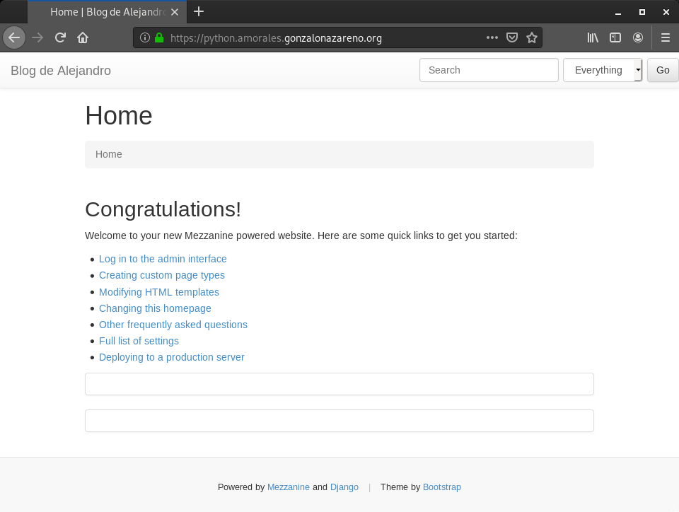
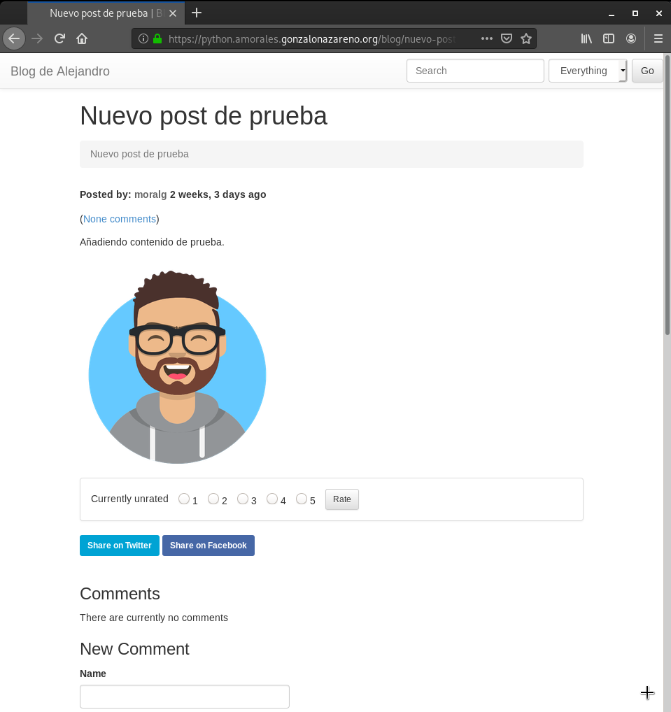

# Tarea 8) Instalación de aplicación python (APLICACIONES WEBS)

#### En esta tarea vamos a desplegar un CMS python . Hemos elegido Mezzanine, pero puedes elegir otro CMS python basado en django.

### 1. Instala el CMS en el entorno de desarrollo. Debes utilizar un entorno virtual.
-------------------------------------------------------------------

###### Creamos el entorno virtual de la siguiente manera:
~~~
python3 -m venv Mezzanine
source Mezzanine/bin/activate
~~~

###### Ahora intalamos mezzanine en el entorno virtual con 'pip'

~~~
pip install mezzanine
~~~

###### Creamos un proyecto nuevo.
~~~
cd /home/moralg

mezzanine-project iaw_mezzanine
~~~

###### Creamos un un fichero requirements y volcamos en el los paquetes instalados actualmente en el entorno virtual.

~~~
cd /home/moralg/iaw_mezzanine

pip freeze > requirements.txt

cat requirements.txt
beautifulsoup4==4.8.1
bleach==3.1.0
certifi==2019.11.28
chardet==3.0.4
Django==1.11.27
django-contrib-comments==1.9.2
filebrowser-safe==0.5.0
future==0.18.2
grappelli-safe==0.5.2
idna==2.8
Mezzanine==4.3.1
oauthlib==3.1.0
Pillow==6.2.1
pkg-resources==0.0.0
pytz==2019.3
requests==2.22.0
requests-oauthlib==1.3.0
six==1.13.0
soupsieve==1.9.5
tzlocal==2.0.0
urllib3==1.25.7
webencodings==0.5.1
~~~

> NOTA: Dentro del fichero requirement.txt tendremos que elimnar un paquete llamado 'pak-resources==0.0.0', editamos el fichero y listo.

###### Creamos la base de datos. Para realizar esto tenemos que situarnos en el directorio /home/moralg/mezzanine/pythoncms

~~~
cd /home/moralg/iaw_mezzanine

python3 manage.py migrate
    Operations to perform:
      Apply all migrations: admin, auth, blog, conf, contenttypes, core, django_comments,   forms, galleries, generic, pages, redirects, sessions, sites, twitter
    Running migrations:
      Applying contenttypes.0001_initial... OK
      Applying auth.0001_initial... OK
      Applying admin.0001_initial... OK
      Applying admin.0002_logentry_remove_auto_add... OK
      Applying contenttypes.0002_remove_content_type_name... OK
      Applying auth.0002_alter_permission_name_max_length... OK
      Applying auth.0003_alter_user_email_max_length... OK
      Applying auth.0004_alter_user_username_opts... OK
      Applying auth.0005_alter_user_last_login_null... OK
      Applying auth.0006_require_contenttypes_0002... OK
      Applying auth.0007_alter_validators_add_error_messages... OK
      Applying auth.0008_alter_user_username_max_length... OK
      Applying sites.0001_initial... OK
      Applying blog.0001_initial... OK
      Applying blog.0002_auto_20150527_1555... OK
      Applying blog.0003_auto_20170411_0504... OK
      Applying conf.0001_initial... OK
      Applying core.0001_initial... OK
      Applying core.0002_auto_20150414_2140... OK
      Applying django_comments.0001_initial... OK
      Applying django_comments.0002_update_user_email_field_length... OK
      Applying django_comments.0003_add_submit_date_index... OK
      Applying pages.0001_initial... OK
      Applying forms.0001_initial... OK
      Applying forms.0002_auto_20141227_0224... OK
      Applying forms.0003_emailfield... OK
      Applying forms.0004_auto_20150517_0510... OK
      Applying forms.0005_auto_20151026_1600... OK
      Applying forms.0006_auto_20170425_2225... OK
      Applying galleries.0001_initial... OK
      Applying galleries.0002_auto_20141227_0224... OK
      Applying generic.0001_initial... OK
      Applying generic.0002_auto_20141227_0224... OK
      Applying generic.0003_auto_20170411_0504... OK
      Applying pages.0002_auto_20141227_0224... OK
      Applying pages.0003_auto_20150527_1555... OK
      Applying pages.0004_auto_20170411_0504... OK
      Applying redirects.0001_initial... OK
      Applying sessions.0001_initial... OK
      Applying sites.0002_alter_domain_unique... OK
      Applying twitter.0001_initial... OK
~~~

###### Creamos el usuario administrador.

~~~
cd /home/moralg/iaw_mezzanine

python3 manage.py createsuperuser
    Username (leave blank to use 'moralg'):
    Email address: ale95mogra@gmail.com
    Password:
    Password (again):
    Superuser created successfully.
~~~

###### Ejecutamos el servidor para comprobar que todo funciona.

~~~
cd /home/moralg/iaw_mezzanine

python3 manage.py runserver
                  .....
              _d^^^^^^^^^b_
           .d''           ``b.
         .p'                `q.
        .d'                   `b.
       .d'                     `b.   * Mezzanine 4.3.1
       ::                       ::   * Django 1.11.27
      ::    M E Z Z A N I N E    ::  * Python 3.7.3
       ::                       ::   * SQLite 3.27.2
       `p.                     .q'   * Linux 4.19.0-6-amd64
        `p.                   .q'
         `b.                 .d'
           `q..          ..p'
              ^q........p^
                  ''''

    Performing system checks...

    System check identified no issues (0 silenced).
    December 21, 2019 - 12:07:07
    Django version 1.11.27, using settings 'pythoncms.settings'
    Starting development server at http://127.0.0.1:8000/
    Quit the server with CONTROL-C.
~~~

###### Una vez iniciado el servidor, podemos acceder a la dirección 'localhost:8000'

###### Comprobación:

###### Como podemos ver, ya tenemos instalado Mezzanine en un entorno virtual en desarrollo, el siguiente paso realizar algunas modificaciones para luego realizar el despliegue de dicha aplicación.

### 2. Personaliza la página (cambia el nombre al blog y pon tu nombre) y añade contenido (algún artículo con alguna imagen).
--------------------------------------------------------------------

###### Vamos a cambiar el nombre del blog y vamos a poner 'Alejandro' y creamos un nuevo articulo.

##### Cambiamos el nombre:

###### Vamos a acceder a la dirección 'localhost:8000/admin'

###### Nos logueamos con el usuario 'moralg' y con la contraseña que asignamos en el paso anterior.

###### Accedemos a la zona del administrador

###### Para cambiar el nombre tenemos que ir a 'Settings' y en el apartado 'Site' cambiamos la descripción del sitio y el nombre.

##### Creamos un nuevo articulo:

###### Para añadir un nuevo post, tenemos que ir a 'Blog posts' y hacer click en 'Add'

###### Guardamos y ya tenemos nuestra página modificada

##### Comprobación:

### 3. Guarda los ficheros generados durante la instalación en un repositorio github. Guarda también en ese repositorio la copia de seguridad de la base de datos.
--------------------------------------------------------------------

###### Para realizar el despliegue al entorno de producción, antes tenemos que guardar todos lo cambios que hemos realizado en la tarea anterior.

###### Vamos a crear una copia de la base dedatos:

~~~
cd /home/moralg/iaw_mezzanine

python3 manage.py dumpdata > CopiaBaseDatos.json
~~~

###### Ahora vamos a subir los cambios y los nuevos ficheros a Github.

~~~
cd /home/moralg/iaw_mezzanine

git init
    Inicializado repositorio Git vacío en /home/moralg/iaw_mezzanine/.git/

git add -f *

git commit -m "Añadir fichero de mezzanine"
    [master (commit-raíz) fc8f436] Añadir pythoncms
     Committer: Alejandro Morales Gracia <moralg@padano.cheeses.org>
    Tu nombre y correo fueron configurados automáticamente basados
    en tu usuario y nombre de host. Por favor verifica que son correctos.
    Tu puedes suprimir este mensaje configurándolos de forma explicita. Ejecuta el
    siguiente comando y sigue las instrucciones de tu editor
     para modificar tu archivo de configuración:

        git config --global --edit

    Tras hacer esto, puedes arreglar la identidad usada para este commit con:

        git commit --amend --reset-author

     21 files changed, 1355 insertions(+)
     create mode 100644 CopiaBaseDatos.json
     create mode 100644 deploy/crontab.template
     create mode 100644 deploy/gunicorn.conf.py.template
     create mode 100644 deploy/local_settings.py.template
     create mode 100644 deploy/nginx.conf.template
     create mode 100644 deploy/supervisor.conf.template
     create mode 100644 dev.db
     create mode 100644 fabfile.py
     create mode 100644 iaw_mezzanine/__init__.py
     create mode 100644 iaw_mezzanine/__pycache__/__init__.cpython-37.pyc
     create mode 100644 iaw_mezzanine/__pycache__/settings.cpython-37.pyc
     create mode 100644 iaw_mezzanine/__pycache__/urls.cpython-37.pyc
     create mode 100644 iaw_mezzanine/local_settings.py
     create mode 100644 iaw_mezzanine/settings.py
     create mode 100644 iaw_mezzanine/urls.py
     create mode 100644 iaw_mezzanine/wsgi.py
     create mode 100644 manage.py
     create mode 100644 requirements.txt
     create mode 100644 static/media/uploads/.thumbnails/alejandroavatar.png/   alejandroavatar-279x296.png
     create mode 100644 static/media/uploads/.thumbnails/alejandroavatar.png/   alejandroavatar-60x60.png
     create mode 100644 static/media/uploads/alejandroavatar.png

git remote add origin git@github.com:MoralG/iaw_mezzanine.git

git push -u origin master
    Enumerando objetos: 31, listo.
    Contando objetos: 100% (31/31), listo.
    Compresión delta usando hasta 8 hilos
    Comprimiendo objetos: 100% (27/27), listo.
    Escribiendo objetos: 100% (31/31), 111.70 KiB | 684.00 KiB/s, listo.
    Total 31 (delta 0), reusado 0 (delta 0)
    To github.com:MoralG/iaw_mezzanine.git
     * [new branch]      master -> master
    Rama 'master' configurada para hacer seguimiento a la rama remota 'master' de   'origin'.
~~~

### 4. Realiza el despliegue de la aplicación en tu entorno de producción (servidor web y servidor de base de datos en el cloud). Utiliza un entorno virtual. Como servidor de aplicación puedes usar gunicorn o uwsgi (crea una unidad systemd para gestionar este servicio). La aplicación será accesible en la url python.tunombre.gonzalonazareno.org.
----------------------------------------------------------------------

###### Una vez subido todos los fichero necesarios a Github, vamos a trabajar desde el entorno de desarrollo.

###### Vamos a dirigirnos al DocumentRoot y clonar nuestro repositorio 'iaw_mezzanine' en el.

~~~
cd /usr/share/nginx/html/

sudo git clone https://github.com/MoralG/iaw_mezzanine.git
~~~

###### Ahora vamos a instalar 'gunicorn' que es un servidor de aplicaciones WSGI para python y además porque utilizamos nginx.

###### Para instalar 'gunicorn', antes tenemos que instalar el paquete de 'python36' y 'python36-devel'

~~~
sudo dnf install python36 python36-devel
~~~

###### Creamos nuestro entorno virtual:

~~~
cd /usr/share/nginx/html/iaw_mezzanine

python3 -m venv Entorno

source Entorno/bin/activate
~~~

###### Instalamos, con el fichero de requirements.txt del entorno de producción, los paquetes y librerías necesario para la aplicación.

~~~
cd /usr/share/nginx/html/iaw_mezzanine

pip install -r requirements.txt
~~~

###### La base de datos que vamos a utilizar para la aplicación en el entorno de desarrolo es MySQL.

###### Vamos a crear un usuario, una bse de datos y vamos a asignarle privilegios a dicho usuario en el servidor MySQL de la máquina tortilla.

~~~
MariaDB [(none)]> CREATE DATABASE mezzaninedb;
Query OK, 1 row affected (0.00 sec)

MariaDB [(none)]> CREATE USER mezzanine identified by 'mezzanine';
Query OK, 0 rows affected (0.07 sec)

MariaDB [(none)]> GRANT ALL PRIVILEGES ON mezzaninedb.* to mezzanine;
Query OK, 0 rows affected (0.00 sec)

MariaDB [(none)]> flush privileges;
Query OK, 0 rows affected (0.01 sec)
~~~

###### Modificamos el fichero /usr/share/nginx/html/iaw_mezzanine/iaw_mezzanine/settings.py para indicarle información necesaria para conectarse a la base de datos creada en el paso anterior, en el apartado 'DATABASES'.

~~~
#############
# DATABASES #
#############

DATABASES = {
      'default': {
          'ENGINE': 'mysql.connector.django',
          'NAME': 'mezzaninedb',
          'USER': 'mezzanine',
          'PASSWORD': 'mezzanine',
          'HOST': 'sql.amorales.gonzalonazareno.org',
          'PORT': '',
      }
  }
~~~

###### Modificamos también el 'Allowed_hosts' para permitir la dirección 'python.amorales.gonzalonazareno.org' en el apartado 'MAIN DJANGO SETTINGS'

~~~
########################
# MAIN DJANGO SETTINGS #
########################

ALLOWED_HOSTS = ['python.amorales.gonzalonazareno.org']
~~~

###### Vamos a instalar el conector de MySQL para python, que es necesario para realizar la coneccion con el servidor de base de datos.

~~~
pip install mysql-connector-python
~~~

###### Tenemos que elimnar el fichero '/usr/share/nginx/html/iaw_mezzanine/dev.db' para que no haya conflictos con MySQL y SQLite.

~~~
sudo rm /usr/share/nginx/html/iaw_mezzanine/deb.db
~~~

###### Ahora tenemos que eliminar el fichero '/usr/share/nginx/html/iaw_mezzanine/iaw_mezzanine/local_settings.py' para que no lea la información de este, sino del fichero 'settings.py'.

> NOTA: Si en el fichero 'settings.py' no tenemos la 'SECRET_KEY' y el 'NEVERCACHE_KEY', lo copiamos y pegamos antes de borrar el fichero 'local_settings.py'

~~~
SECRET_KEY = "**$on#6@_$)(wl6&-%e4(2^fh2=8(a&*$gb#6%8q!5zgf@z52)"
NEVERCACHE_KEY = "m_6*$9o6hk4c#gq=-=$9o3#+t!929-aj@ct=m0-7doi)bl=^2a"
~~~

###### Eliminamos el fichero 'local_settings.py'

~~~
sudo rm /usr/share/nginx/html/iaw_mezzanine/iaw_mezzanine/local_settings.py
~~~

###### Realizamos la migración a la base de datos de MySQL.

~~~
cd /usr/share/nginx/html/iaw_mezzanine

python3 manage.py migrate
  Operations to perform:
    Apply all migrations: admin, auth, blog, conf, contenttypes, core, django_comments, forms, galleries, generic, pages, redirects, sessions, sites, twitter
  Running migrations:
    Applying contenttypes.0001_initial... OK
    Applying auth.0001_initial... OK
    Applying admin.0001_initial... OK
    Applying admin.0002_logentry_remove_auto_add... OK
    Applying contenttypes.0002_remove_content_type_name... OK
    Applying auth.0002_alter_permission_name_max_length... OK
    Applying auth.0003_alter_user_email_max_length... OK
    Applying auth.0004_alter_user_username_opts... OK
    Applying auth.0005_alter_user_last_login_null... OK
    Applying auth.0006_require_contenttypes_0002... OK
    Applying auth.0007_alter_validators_add_error_messages... OK
    Applying auth.0008_alter_user_username_max_length... OK
    Applying sites.0001_initial... OK
    Applying blog.0001_initial... OK
    Applying blog.0002_auto_20150527_1555... OK
    Applying blog.0003_auto_20170411_0504... OK
    Applying conf.0001_initial... OK
    Applying core.0001_initial... OK
    Applying core.0002_auto_20150414_2140... OK
    Applying django_comments.0001_initial... OK
    Applying django_comments.0002_update_user_email_field_length... OK
    Applying django_comments.0003_add_submit_date_index... OK
    Applying pages.0001_initial... OK
    Applying forms.0001_initial... OK
    Applying forms.0002_auto_20141227_0224... OK
    Applying forms.0003_emailfield... OK
    Applying forms.0004_auto_20150517_0510... OK
    Applying forms.0005_auto_20151026_1600... OK
    Applying forms.0006_auto_20170425_2225... OK
    Applying galleries.0001_initial... OK
    Applying galleries.0002_auto_20141227_0224... OK
    Applying generic.0001_initial... OK
    Applying generic.0002_auto_20141227_0224... OK
    Applying generic.0003_auto_20170411_0504... OK
    Applying pages.0002_auto_20141227_0224... OK
    Applying pages.0003_auto_20150527_1555... OK
    Applying pages.0004_auto_20170411_0504... OK
    Applying redirects.0001_initial... OK
    Applying sessions.0001_initial... OK
    Applying sites.0002_alter_domain_unique... OK
    Applying twitter.0001_initial... OK
~~~

> NOTA: Si se produce algún error en la migración de la base de datos, tenemos que asignar dos parametros a la base de datos para que se pueda ajustar el tamaño de las tablas:

~~~
use mezzaninedb

SET @@global.innodb_large_prefix = 1;

set global innodb_default_row_format = DYNAMIC;
~~~

###### Ahora vamos a cargar los datos del fichero 'CopiaBaseDatos.json' en la base de datos.

~~~
python3 manage.py loaddata CopiaBaseDatos.json
  Installed 153 object(s) from 1 fixture(s)
~~~

###### Instalamos por fín 'gunicorn' con pip.

~~~
pip install gunicorn
~~~

###### Creamos el socket de gunicorn.

###### Para crear dicho socket tenemos que modificar el fichero '/etc/systemd/system/gunicorn.socket' y así poder ejecutarlo en nginx.

###### añadimos lo siguiente:

~~~
[Unit]
Description=gunicorn socket

[Socket]
ListenStream=/run/gunicorn.sock

[Install]
WantedBy=sockets.target
~~~

###### Crearemos una unidad de systemd para guincorn en el fichero '/etc/systemd/system/gunicorn.service'.

~~~
[Unit]
Description=gunicorn daemon
After=network.target

[Service]
WorkingDirectory=/usr/share/nginx/html/iaw_mezzanine
ExecStart=/bin/bash /usr/share/nginx/html/iaw_mezzanine/ScriptMezzanine.sh
ExecReload=/bin/bash /usr/share/nginx/html/iaw_mezzanine/ScriptMezzanine.sh
RemainAfterExit=yes

[Install]
WantedBy=multi-user.target
~~~

###### Esto hará que ejecute este script `/usr/share/nginx/html/iaw_mezzanine/ScriptMezzanine.sh`:
~~~
#!/bin/bash

NAME="iaw_mezzanine"
DJANGODIR=/usr/share/nginx/html/iaw_mezzanine
USER=nginx
GROUP=nginx
WORKERS=3
BIND=unix:/run/gunicorn.sock
DJANGO_SETTINGS_MODULE=iaw_mezzanine.settings
DJANGO_WSGI_MODULE=iaw_mezzanine.wsgi
LOGLEVEL=error

cd $DJANGODIR
source /usr/share/nginx/html/iaw_mezzanine/Entorno/bin/activate

export DJANGO_SETTINGS_MODULE=$DJANGO_SETTINGS_MODULE
export PYTHONPATH=$DJANGODIR:$PYTHONPATH

exec /usr/share/nginx/html/iaw_mezzanine/Entorno/bin/gunicorn ${DJANGO_WSGI_MODULE}:application \
  --name $NAME \
  --workers $WORKERS \
  --user=$USER \
  --group=$GROUP \
  --bind=$BIND \
  --log-level=$LOGLEVEL \
  --log-file=-
~~~

###### Creamos el Virtualhost de nuestra aplicación y añadimos lo siguiente.

~~~
server {
        listen 80;
        server_name python.amorales.gonzalonazareno.org;
        return 301 https://$server_name$request_uri;
}

server {
    listen 443 ssl;
    ssl on;
    ssl_certificate /etc/pki/tls/certs/amorales.gonzalonazareno.org.crt;
    ssl_certificate_key /etc/pki/tls/private/gonzalonazareno.pem;
    server_name python.amorales.gonzalonazareno.org;
    root  /usr/share/nginx/html/iaw_mezzanine;
    location / {
      proxy_set_header X-Forwarded-For $proxy_add_x_forwarded_for;
      proxy_set_header X-Forwarded-Proto $scheme;
      proxy_set_header Host $http_host;
      # we don't want nginx trying to do something clever with
      # redirects, we set the Host: header above already.
      proxy_redirect off;
      proxy_pass http://unix:/run/gunicorn.sock;
    }
    location /static {
        alias  /usr/share/nginx/html/iaw_mezzanine/static;
    }
}
~~~

###### Para que nginx pueda leer los 'static' tenemos que hacer lo siguiente.

~~~
sudo chown -R centos:centos /usr/share/nginx/html/iaw_mezzanine
python3 manage.py collectstatic
sudo chown -R nginx:nginx /usr/share/nginx/html/iaw_mezzanine
~~~

###### Añadimos las reglas de SELinux.

~~~
sudo setsebool -P httpd_can_network_connect on

sudo find /usr/share/nginx/html/iaw_mezzanine -type f -exec chmod 0644 {} \;
sudo find /usr/share/nginx/html/iaw_mezzanine -type d -exec chmod 0755 {} \;

sudo chcon -t httpd_sys_rw_content_t /usr/share/nginx/html/iaw_mezzanine -R
sudo chcon -t httpd_sys_content_t /usr/share/nginx/html/iaw_mezzanine -R
~~~

###### Añadimos el registro en el DNS d la máquina croqueta.

~~~
python          IN      CNAME   salmorejo
~~~

###### Comprobación:

###### Accedemos a nuestra aplicación desde la dirección python.amorales.gonzalonazareno.org

